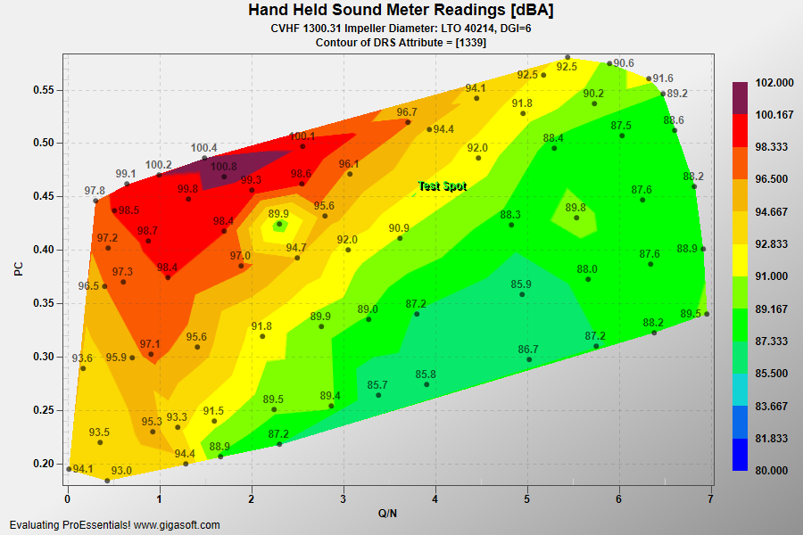

# ProEssentials WPF Delaunay Triangulation — 2D Contour from Scattered Points

A ProEssentials v10 WPF .NET 8 demonstration of Delaunay triangulation contour
rendering using PesgoWpf — the ProEssentials scientific graph object for
continuous numeric X and Y axes.



➡️ [gigasoft.com/examples/147](https://gigasoft.com/examples/147)

---

## What This Demonstrates

**70 scattered hand-held sound meter readings** (Q/N vs PC vs dBA) triangulated
and interpolated into a smooth engineering contour map — no regular grid required.
This is the standard technique for visualizing field measurement data, sensor
networks, and survey results where samples are irregularly distributed across
a 2D domain.

---

## Delaunay Triangulation vs Grid-Based Contour

ProEssentials offers two contour approaches in PesgoWpf. Choosing the right
one depends on your data structure:

| Method | Data Shape | Best For |
|--------|-----------|----------|
| **ContourDelaunay** | Irregular scatter of XY points | Field surveys, sensor grids, acoustic measurements, geographic data |
| ContourColors | Regular rectangular grid | Spectrograms, images, uniform simulation output |

`ContourDelaunay` is the correct choice whenever your data points do **not**
fall on a regular grid — the typical case for real-world measurement campaigns.

---

## ProEssentials Features Demonstrated

### ContourDelaunay — The Plotting Method

```csharp
Pesgo1.PePlot.Method = SGraphPlottingMethod.ContourDelaunay;
```

`ContourDelaunay` (enum value 25 in `SGraphPlottingMethod`) is a self-contained
plotting method that:

1. Computes the [Delaunay triangulation](https://en.wikipedia.org/wiki/Delaunay_triangulation)
   of all XY point positions
2. Interpolates Z (dBA) values across each triangle
3. Renders the result as a continuous filled contour surface

### Data Model — XYZ Scatter, Not a Grid

```csharp
Pesgo1.PeData.Subsets = 1;        // always 1 for Delaunay
Pesgo1.PeData.Points  = 70;       // number of scattered measurement points

Pesgo1.PeData.X[0, p] = fX;      // Q/N  — flow coefficient (horizontal)
Pesgo1.PeData.Y[0, p] = fY;      // PC   — pressure coefficient (vertical)
Pesgo1.PeData.Z[0, p] = fZ;      // dBA  — the quantity being contoured
```

### Graph Annotations on Every Data Point

```csharp
Pesgo1.PeAnnotation.Graph.X[p]    = fX;
Pesgo1.PeAnnotation.Graph.Y[p]    = fY;
Pesgo1.PeAnnotation.Graph.Type[p] = (int)GraphAnnotationType.SmallDotSolid;
Pesgo1.PeAnnotation.Graph.Text[p] = string.Format("{0:##0.0}", fZ);
```

Each of the 70 measurement locations is marked with a dot symbol and its dBA
value as a text label — making individual readings visible on top of the
interpolated surface. A named `Pointer` annotation marks a specific test spot.

### Manual Z Range Control

```csharp
Pesgo1.PeGrid.Configure.ManualScaleControlZ = ManualScaleControl.MinMax;
Pesgo1.PeGrid.Configure.ManualMinZ          = 80.0F;
Pesgo1.PeGrid.Configure.ManualMaxZ          = 102.0F;
```

Clamps the contour color scale to the known dBA measurement range. Prevents
a single outlier from skewing the entire color ramp — critical for engineering
contour maps where absolute scale reference matters.

### Custom Contour Color Array

```csharp
Pesgo1.PeColor.ContourColors.Clear(6);
Pesgo1.PeColor.ContourColors[0] = Color.FromArgb(255, 0,   0,   255); // blue
Pesgo1.PeColor.ContourColors[1] = Color.FromArgb(255, 17,  211, 214); // cyan
Pesgo1.PeColor.ContourColors[2] = Color.FromArgb(255, 0,   255, 0);   // green
Pesgo1.PeColor.ContourColors[3] = Color.FromArgb(255, 255, 255, 0);   // yellow
Pesgo1.PeColor.ContourColors[4] = Color.FromArgb(255, 245, 181, 5);   // orange
Pesgo1.PeColor.ContourColors[5] = Color.FromArgb(255, 255, 0,   0);   // red
Pesgo1.PeColor.ContourColors[6] = Color.FromArgb(255, 0,   55,  155); // dark blue

Pesgo1.PeColor.ContourColorBlends = 2;   // set BEFORE ContourColorSet
Pesgo1.PeColor.ContourColorAlpha  = 225;
Pesgo1.PeColor.ContourColorSet    = ContourColorSet.ContourColors;
```

`ContourColorBlends` must always be set **before** `ContourColorSet`.

### PeCustomTrackingDataText Event — Custom Tooltip (WPF)

```csharp
// Wire up in Loaded event handler:
Pesgo1.PeCustomTrackingDataText += Pesgo1_PeCustomTrackingDataText;

// Handler:
private void Pesgo1_PeCustomTrackingDataText(object sender,
    Gigasoft.ProEssentials.EventArg.CustomTrackingDataTextEventArgs e)
{
    double dX = Pesgo1.PeUserInterface.Cursor.CursorValueX;
    double dY = Pesgo1.PeUserInterface.Cursor.CursorValueY;

    e.TrackingText = string.Format(
        "Q/N:  {0:0.0000}\nPC:   {1:0.0000}\ndBA:  {2}",
        dX, dY, e.TrackingText);
}
```

`TrackingCustomDataText = true` activates this event. The handler reads the
cursor's data-coordinate position and replaces the default tooltip with a
formatted multi-line readout. `e.TrackingText` on entry already contains the
interpolated Z value from the Delaunay mesh.

### Monochrome Fallback

```csharp
for (int s = 0; s < 30; s++)
    Pesgo1.PeColor.SubsetShades[s] = Color.FromArgb(255,
        (byte)(50 + (s * 2)), (byte)(50 + (s * 2)), (byte)(50 + (s * 2)));
```

When the chart is viewed or printed in monochrome mode, `SubsetShades` provides
grayscale bands that replace the color contours.

---

## Data File

`DelaunaySample.txt` — 70 lines, space-delimited `X Y Z` per line.

- **X** — Q/N (flow coefficient)
- **Y** — PC (pressure coefficient)
- **Z** — dBA (sound level measurement)

Copied to the output directory automatically on build.

---

## Controls

| Input | Action |
|-------|--------|
| Left-click drag | Zoom box |
| Right-click / `z` | Undo zoom |
| Mouse wheel | Horizontal + vertical zoom |
| Mouse drag | Pan |
| Right-click | Context menu — export, print, customize, annotations |
| Double-click | Customization dialog |

---

## Prerequisites

- Visual Studio 2022
- .NET 8 SDK
- Internet connection for NuGet restore

---

## How to Run

```
1. Clone this repository
2. Open DelaunayTriangulation.sln in Visual Studio 2022
3. Build → Rebuild Solution (NuGet restore is automatic)
4. Press F5
```

---

## NuGet Package

References
[`ProEssentials.Chart.Net80.x64.Wpf`](https://www.nuget.org/packages/ProEssentials.Chart.Net80.x64.Wpf).
Package restore is automatic on build.

---

## Related Examples

- [WPF Heatmap Spectrogram — Grid-Based Contour](https://github.com/GigasoftInc/wpf-chart-heatmap-spectrogram-proessentials)
- [WPF Quickstart — Simple Scientific Graph](https://github.com/GigasoftInc/wpf-chart-quickstart-proessentials)
- [Financial OHLC — Trading Signals](https://github.com/GigasoftInc/wpf-chart-financial-ohlc-trading-signals-proessentials)
- [3D Realtime Surface — ComputeShader](https://github.com/GigasoftInc/wpf-3d-surface-realtime-computeshader-proessentials)
- [All Examples — GigasoftInc on GitHub](https://github.com/GigasoftInc)
- [Full Evaluation Download](https://gigasoft.com/net-chart-component-wpf-winforms-download)
- [gigasoft.com](https://gigasoft.com)

---

## License

Example code is MIT licensed. ProEssentials requires a commercial
license for continued use.
